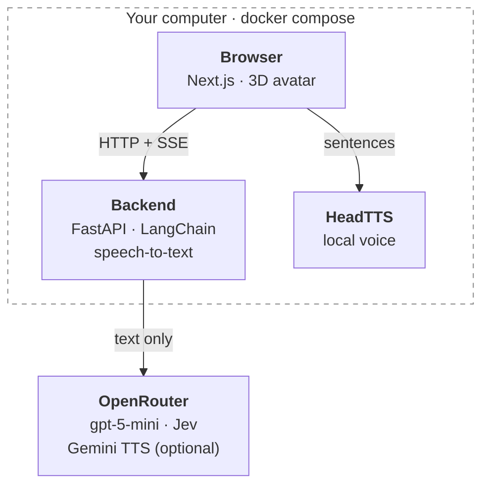
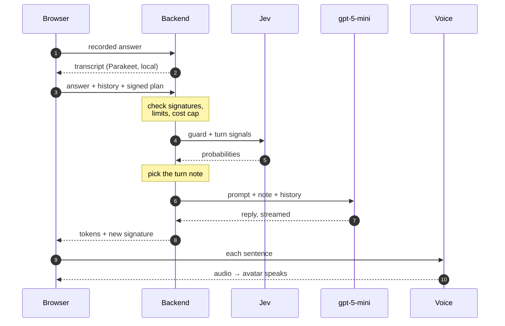

# Architecture

## The pieces

| Piece | What it does |
|---|---|
| **Browser** (Next.js 16, React 19) | Setup, interview and results pages. Holds the whole interview state (Zustand, in `sessionStorage`). Plays the 3D avatar ([TalkingHead](https://github.com/met4citizen/TalkingHead)), records the microphone, splits replies into sentences for speech. |
| **Backend** (Python, FastAPI) | Every AI call goes through it: CV reading, the plan, each interview turn, the feedback. Also runs speech-to-text on the CPU. **Stateless**: the browser sends the full context with every request. |
| **HeadTTS** (Node) | The free local voice: text in, audio plus mouth-shape timings out. |
| **OpenRouter** | gpt-5-mini writes; **Jev** (`typesafe/jev-1.13`) decides. Jev is a decision model, not an LLM: it answers yes/no questions with calibrated probabilities. It guards every input, steers the turns and scores the answers. |

**What never leaves the machine:** the candidate's voice (transcribed locally) and the CV file (read in memory, never stored). Only text goes to OpenRouter.

## One interview, start to end

| Stage | Endpoint | What happens | Models, in order |
|---|---|---|---|
| 1. Setup | `GET /api/presets`, `/api/config` | Pick a parody company (Guugle, Netflux, …), a role, difficulty, interviewer style. Optional: a job description, the "cloud voice" switch. | – |
| 2. CV | `POST /api/cv/parse` | PDF checked by content (≤ 5 MB, 5 pages) → text with `pypdf` → Jev: "is this a CV? is there an injection?" → a structured profile the candidate can edit. Or pick a preset CV. | Jev, then gpt-5-mini (effort `low`) |
| 3. Plan | `POST /api/interview/plan` | Jev checks role, job description and profile → a question plan tailored to the CV, each question with a scoring rubric. The plan is **signed** (HMAC) and kept by the browser. | Jev, then gpt-5-mini (`low`) |
| 4. Turns | `POST /api/interview/chat/stream` | The interview itself, one turn per answer (below). | Parakeet (spoken answers), Jev, then gpt-5-mini (`minimal`) |
| 5. Feedback | `POST /api/interview/feedback` | Jev scores every answer against its rubric (one probability per criterion → 1–5). The LLM writes the text: feedback per question, strengths, improvements, a sample answer for the weakest one. | Jev, then gpt-5-mini (`low`) |
| 6. Results | – | Scorecard, badges (wrong claim, contradiction, couldn't verify), printable report. | – |

## One turn in detail

- **The turn note decides the turn.** In one call Jev answers: is it an injection or abuse? Did they answer? Was it vague? Do they want to end? Is there a wrong claim or a contradiction? The answers become one short instruction for this reply: ask the next question, follow up on a vague answer, ask about a wrong claim or a contradiction, steer back, or end. The [evals](evals/interviewer.md) found this matters far more than the prompt technique.
- **Streaming, sentence by sentence.** The first sentence is spoken while the rest is still being written. The voice is HeadTTS, or Gemini TTS through the backend when the cloud voice is on. Pressing the mic interrupts the avatar.
- **Message roles:** the *system* message is the composed prompt: technique, plan, security rules, canary. The *user* messages are the candidate's answers, wrapped in `<candidate_message>` tags as data. The *assistant* messages are the interviewer's earlier replies, part of the signed history. The turn note goes in as a second system message after the history.
- **The transcript is always on screen**, and the avatar is decoration: everything it says is also text.

## Security in short

Every piece of untrusted text (chat, transcript, CV, job description, role) goes through the same layers:

| Layer | Kind | What it does |
|---|---|---|
| **Limits** | exact | Message length, CV size/pages/type, JD ≤ 8k chars, per-IP rate limits, $0.10 cost cap per interview |
| **Signatures** | exact | HMAC over the plan and over the transcript: an edited plan or a forged history is rejected before any model runs |
| **Jev guard** | probabilistic | Blocks when P(injection) + P(abuse) ≥ 0.5. Fails closed. Refuses in character ("Let's keep this about the interview…") |
| **Data, not instructions** | exact + probabilistic | Candidate text is wrapped in tags with `<` `>` escaped, so it can't break out; the prompt tells the model to treat it as data |
| **Canary token** | exact | A secret word in the system prompt: if it appears in a reply, the reply is replaced |

Tested with 37 attacks and 8 legit controls, 5 runs each: [jailbreak tests](evals/jailbreak.md).

## Key design choices

- **Stateless backend.** No database and no sessions: the browser holds the interview, and the server proves it wasn't changed with signatures. The only server-side state is in memory: rate-limit counters and each session's spent cost.
- **LangChain for LLM calls, plain HTTP for the rest.** All chat and structured-output calls are LangChain chains (`backend/src/backend/chains/`). Structured output uses strict function calling. Jev, TTS and STT aren't chat models, so they're direct calls.
- **Prompts are files** (`backend/src/backend/prompts/`). The five interviewer techniques can be switched in the developer panel (gear icon or `?dev=1`), together with model, effort and max tokens. It also shows the full system prompt, the cost of each call and a log of the guard's verdicts.
- **Typed end to end.** Pydantic schemas on the backend; the frontend's API types are generated from FastAPI's OpenAPI schema.
- **Office backgrounds** were generated once in Gemini (web), one per company, and committed as images. They contain no text or logos; the company name only appears in the interviewer's name tag.

## Repository map

| Folder | Contents |
|---|---|
| `frontend/` | Next.js app: `app/` (pages), `components/` (interview, avatar, results, benchmarks, dev panel, shadcn `ui/`), `lib/` (store, API client, speech queue, lip-sync) |
| `backend/src/backend/` | `api/` (endpoints), `chains/` (LLM calls), `guard/` (Jev, canary, signatures, delimiters), `prompts/`, `schemas/`, `services/` (CV reader, scoring, STT, TTS) |
| `backend/evals/` | The eval and jailbreak harnesses |
| `backend/tests/` | pytest, with fake LLMs: tests never call a real API |
| `headtts/` | The local voice service (model and voices baked into the image) |
| `docs/` | `architecture.md`, `decisions/`, `evals/`, and `spikes/` (the scripts behind their numbers) |

## Decisions and evals

| Doc | The question it answers |
|---|---|
| [Text-to-speech](decisions/text-to-speech.md) | Which voice: local HeadTTS, Gemini TTS, or gpt-audio? |
| [Speech-to-text](decisions/speech-to-text.md) | Which local model turns the answer into text? |
| [Challenge signal](decisions/challenge-signal.md) | How does the interviewer push back on wrong claims and contradictions? |
| [Interviewer evals](evals/interviewer.md) | Which prompt technique, model and effort? Could a local model do it? |
| [Feedback evals](evals/feedback.md) | Does the technique matter for the feedback? Where does it still fail? |
| [Jailbreak tests](evals/jailbreak.md) | Can a candidate break the interviewer? |
